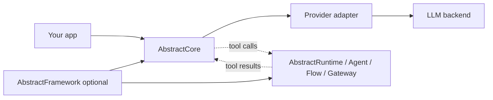

# AbstractCore

[](https://pypi.org/project/abstractcore/)
[](https://github.com/lpalbou/AbstractCore/actions/workflows/ci.yml)
[](https://github.com/lpalbou/AbstractCore/actions/workflows/ci.yml)
[](https://github.com/lpalbou/AbstractCore/blob/main/LICENSE)
[](https://github.com/lpalbou/AbstractCore/stargazers)

Unified LLM Interface
> Write once, run everywhere

AbstractCore is an offline-capable, open-source-first LLM infrastructure layer
for Python applications. It gives you one `create_llm(...)` API across local
runtimes, self-hosted servers, cloud APIs, and OpenAI-compatible gateways.

Use it in-process from Python, or run it as a universal `/v1` endpoint for apps
that already speak the OpenAI API. The same application can run fully offline
once local model assets are installed, stay private on your own inference
server, or route to hosted providers when you want managed capacity.

The goal is simple: put LLM capability at your fingertips without tying your
product to a vendor, network connection, or model family. AbstractCore keeps
application code portable while the model underneath moves between OpenAI,
Anthropic, Ollama, LM Studio, MLX, HuggingFace/GGUF, vLLM, OpenRouter, Portkey,
or any OpenAI-compatible backend.

The default install is intentionally lightweight; add providers and optional
subsystems via explicit install extras. For local runtimes, AbstractCore is
cache-first and offline-first: it will not silently download model weights; you
pull or prefetch the models you want, then run without internet when your
chosen provider and tools are local.

First-class support for:
- offline-capable local operation with explicit model setup (no silent downloads)
- local/open-weight model backends (Ollama, LM Studio, MLX, HuggingFace/GGUF, vLLM)
- cloud, hosted gateway, and generic OpenAI-compatible providers
- sync + async
- streaming + non-streaming
- universal tool calling (native + prompted tool syntax)
- structured output (Pydantic)
- unified generation parameters, capability detection, and provider quirks
- session memory, prompt caching, durable memory bloc cache artifacts, events, tracing, and retry-aware reliability hooks
- media input (images/audio/video + documents) with explicit, policy-driven fallbacks (*)
- optional capability plugins (`core.voice/core.audio/core.vision/core.music`) for deterministic TTS/STT, generative vision, and music backends (via packages such as `abstractvoice`, `abstractvision`, and `abstractmusic`)
- glyph visual-text compression for long documents (**)
- optional OpenAI-compatible `/v1` gateway server (multi-provider) and single-model endpoint

(*) Media input is policy-driven (no silent semantic changes). If a model doesn’t support images, AbstractCore can use a configured vision model to generate short visual observations and inject them into your text-only request (vision fallback). Audio/video attachments are also policy-driven (`audio_policy`, `video_policy`) and may require capability plugins for fallbacks. See [Media Handling](docs/media-handling-system.md) and [Centralized Config](docs/centralized-config.md).
(**) Optional visual-text compression: render long text/PDFs into images and process them with a vision model to reduce token usage. See [Glyph Visual-Text Compression](docs/glyphs.md) (install `pip install "abstractcore[compression]"`; for PDFs also install `pip install "abstractcore[media]"`).

Generative vision uses `abstractvision` when installed. In server mode, omit
`model` only when the server has a configured image default, or use explicit
provider/model ids such as `diffusers/default`, `diffusers/<huggingface-repo>`,
`sdcpp/default`, or `openai-compatible/<model>`.

Docs: [Getting Started](docs/getting-started.md) · [FAQ](docs/faq.md) · [Docs Index](docs/README.md) · https://lpalbou.github.io/AbstractCore

For AI assistants and doc-indexing tools, this repository also publishes
[`llms.txt`](llms.txt) and [`llms-full.txt`](llms-full.txt). MCP clients such as
Context7 can query the public documentation directly as well.

## Why AbstractCore

Many libraries can call an LLM. AbstractCore is for the messy middle of real
applications, where you need the same product code to survive different model
families, local inference servers, API dialects, offline deployments, and
capability gaps.

Open-source and self-hosted models are first-class, not a demo path. AbstractCore
handles the things that often break when you move beyond a single hosted API:
prompted vs native tools, schema-following differences, structured-output retry,
reasoning text, media support, token budget vocabulary, local server discovery,
and prompt/cache behavior.

That makes it a practical foundation for privacy-sensitive assistants, local
developer tools, document workflows, research machines, edge deployments, and
cloud-backed production services. You can build remote-first products, fully
local products, or hybrid products that move between the two as cost, privacy,
latency, and hardware constraints change.

Use AbstractCore when you want a focused provider layer that stays close to your
application code. Use the wider AbstractFramework stack when you also need
durable runtime execution, agents, flows, gateways, agentic CLI surfaces, memory,
or assistant applications such as
[AbstractAssistant](https://github.com/lpalbou/abstractassistant).

## AbstractFramework ecosystem

AbstractCore is part of the **AbstractFramework** ecosystem:

- **AbstractFramework (umbrella)**: https://github.com/lpalbou/AbstractFramework
- **AbstractCore (this package)**: provider-agnostic LLM I/O + reliability primitives
- **AbstractRuntime**: durable tool/effect execution, workflows, and state persistence (recommended host runtime) — https://github.com/lpalbou/abstractruntime
- **Wider stack**: agents, flows, gateway control, agentic CLI integrations, memory, semantics, coding tools, and digital assistant surfaces built on the same foundation

By default, AbstractCore is **pass-through for tools** (`execute_tools=False`): it returns structured tool calls in `response.tool_calls`, and your runtime decides *whether/how* to execute them (policy, sandboxing, retries, persistence). See [Tool Calling](docs/tool-calling.md) and [Architecture](docs/architecture.md).



## Install

Choose the smallest install that matches where your models run. Extras compose,
so you can start with `abstractcore[remote]` and add `media`, `tools`, `server`,
or local runtime extras as your app grows.

```bash
# Core: local HTTP servers and gateways that need no SDK
# Includes Ollama, LM Studio, OpenRouter, Portkey, and OpenAI-compatible /v1 endpoints
pip install abstractcore

# Hosted API SDKs (OpenAI + Anthropic). OpenRouter/Portkey still work from core.
pip install "abstractcore[remote]"

# Individual provider SDKs / local runtimes
pip install "abstractcore[openai]"       # OpenAI SDK
pip install "abstractcore[anthropic]"    # Anthropic SDK
pip install "abstractcore[huggingface]"  # Transformers / torch (heavy)
pip install "abstractcore[apple]"        # Apple Silicon local LLM stack (alias of mlx; heavy)
pip install "abstractcore[gpu]"          # GPU local LLM stack (alias of vllm; heavy)
pip install "abstractcore[mlx]"          # Explicit MLX provider extra
pip install "abstractcore[vllm]"         # Explicit vLLM provider extra

# Optional application features
pip install "abstractcore[tools]"       # built-in web tools (web_search, skim_websearch, skim_url, fetch_url)
pip install "abstractcore[media]"       # images, PDFs, Office docs
pip install "abstractcore[voice]"       # abstractvoice plugin (TTS/STT capability)
pip install "abstractcore[vision]"      # abstractvision plugin (generative vision capability)
pip install "abstractcore[compression]" # glyph visual-text compression (Pillow-only)
pip install "abstractcore[embeddings]"  # EmbeddingManager + local embedding models
pip install "abstractcore[tokens]"      # precise token counting (tiktoken)
pip install "abstractcore[server]"      # OpenAI-compatible HTTP gateway

# Combine extras (zsh: keep quotes)
pip install "abstractcore[remote,media,tools]"

# Turnkey local-runtime installs
pip install "abstractcore[all-apple]"    # Apple Silicon: remote SDKs + HF/GGUF + MLX + features + server
pip install "abstractcore[all-gpu]"      # GPU host: remote SDKs + HF/GGUF + vLLM + features + server
```

`apple`/`gpu` are hardware-profile aliases for the local LLM engine stack.
`all-apple`/`all-gpu` are larger aggregate profiles for a full local-development
environment.

## Quickstart

Local/offline example (requires Ollama running with `ollama pull qwen3:4b`
already done):

```python
from abstractcore import create_llm

llm = create_llm("ollama", model="qwen3:4b")
response = llm.generate("Draft a privacy-preserving onboarding checklist.")
print(response.content)
```

Remote API example (requires `pip install "abstractcore[openai]"`):

```python
from abstractcore import create_llm

llm = create_llm("openai", model="gpt-4o-mini")
response = llm.generate("What is the capital of France?")
print(response.content)
```

### Conversation state (`BasicSession`)

```python
from abstractcore import create_llm, BasicSession

session = BasicSession(create_llm("anthropic", model="claude-haiku-4-5"))
print(session.generate("Give me 3 bakery name ideas.").content)
print(session.generate("Pick the best one and explain why.").content)
```

### Streaming

```python
from abstractcore import create_llm

llm = create_llm("ollama", model="qwen3:4b")
for chunk in llm.generate("Write a short poem about distributed systems.", stream=True):
    print(chunk.content or "", end="", flush=True)
```

### Async

```python
import asyncio
from abstractcore import create_llm

async def main():
    llm = create_llm("openai", model="gpt-4o-mini")
    resp = await llm.agenerate("Give me 5 bullet points about HTTP caching.")
    print(resp.content)

asyncio.run(main())
```

## Token budgets (unified)

```python
from abstractcore import create_llm

llm = create_llm(
    "openai",
    model="gpt-4o-mini",
    max_tokens=8000,        # total budget (input + output)
    max_output_tokens=1200, # output cap
)
```

## Providers (common)

Open-source-first: local providers (Ollama, LMStudio, vLLM, openai-compatible, HuggingFace, MLX) are first-class. Cloud and gateway providers are optional.

- `openai`: `OPENAI_API_KEY`, optional `OPENAI_BASE_URL`
- `anthropic`: `ANTHROPIC_API_KEY`, optional `ANTHROPIC_BASE_URL`
- `openrouter`: `OPENROUTER_API_KEY`, optional `OPENROUTER_BASE_URL` (default: `https://openrouter.ai/api/v1`)
- `portkey`: `PORTKEY_API_KEY`, `PORTKEY_CONFIG` (config id), optional `PORTKEY_BASE_URL` (default: `https://api.portkey.ai/v1`)
- `ollama`: local server at `OLLAMA_BASE_URL` (or legacy `OLLAMA_HOST`)
- `lmstudio`: OpenAI-compatible local server at `LMSTUDIO_BASE_URL` (default: `http://localhost:1234/v1`)
- `vllm`: OpenAI-compatible server at `VLLM_BASE_URL` (default: `http://localhost:8000/v1`)
- `openai-compatible`: generic OpenAI-compatible endpoints via `OPENAI_BASE_URL` (default: `http://localhost:1234/v1`)
- `huggingface`: local models via Transformers (optional `HUGGINGFACE_TOKEN` for gated downloads)
- `mlx`: Apple Silicon local models (optional `HUGGINGFACE_TOKEN` for gated downloads)

You can also persist settings (including API keys) via the config CLI:
- `abstractcore --status`
- `abstractcore --configure` (alias: `--config`)
- `abstractcore --set-api-key openai sk-...`
- `abstractcore --set-server-auth-token acore-server-secret`

## What’s inside (quick tour)

- Tools: universal tool calling across providers → [Tool Calling](docs/tool-calling.md)
- Built-in tools (optional): web + filesystem helpers (`skim_websearch`, `skim_url`, `fetch_url`, `read_file`, …) → [Tool Calling](docs/tool-calling.md)
- Tool syntax rewriting: `tool_call_tags` (Python) and `agent_format` (server) → [Tool Syntax Rewriting](docs/tool-syntax-rewriting.md)
- Structured output: Pydantic-first with provider-aware strategies → [Structured Output](docs/structured-output.md)
- Media input: images/audio/video + documents (policies + fallbacks) → [Media Handling](docs/media-handling-system.md) and [Vision Capabilities](docs/vision-capabilities.md)
- Capability plugins (optional): deterministic `llm.voice/llm.audio/llm.vision/llm.music` surfaces and shared provider/model discovery → [Capabilities](docs/capabilities.md)
- Glyph visual-text compression: scale long-context document analysis via VLMs → [Glyph Visual-Text Compression](docs/glyphs.md)
- Embeddings and semantic search → [Embeddings](docs/embeddings.md)
- Observability: global event bus + interaction traces → [Architecture](docs/architecture.md), [API Reference (Events)](docs/api-reference.md#eventtype), [Interaction Tracing](docs/interaction-tracing.md)
- MCP (Model Context Protocol): discover tools from MCP servers (HTTP/stdio) → [MCP](docs/mcp.md)
- OpenAI-compatible server: one `/v1` gateway for chat + optional `/v1/images/*` and `/v1/audio/*` endpoints → [Server](docs/server.md)

## Tool calling (passthrough by default)

By default (`execute_tools=False`), AbstractCore:
- returns clean assistant text in `response.content`
- returns structured tool calls in `response.tool_calls` (host/runtime executes them)

```python
from abstractcore import create_llm, tool

@tool
def get_weather(city: str) -> str:
    return f"{city}: 22°C and sunny"

llm = create_llm("openai", model="gpt-4o-mini")
resp = llm.generate("What's the weather in Paris? Use the tool.", tools=[get_weather])

print(resp.content)
print(resp.tool_calls)
```

If you need tool-call markup preserved/re-written in `content` for downstream parsers, pass
`tool_call_tags=...` (e.g. `"qwen3"`, `"llama3"`, `"xml"`). See [Tool Syntax Rewriting](docs/tool-syntax-rewriting.md).

## Structured output

```python
from pydantic import BaseModel
from abstractcore import create_llm

class Answer(BaseModel):
    title: str
    bullets: list[str]

llm = create_llm("openai", model="gpt-4o-mini")
answer = llm.generate("Summarize HTTP/3 in 3 bullets.", response_model=Answer)
print(answer.bullets)
```

## Media input (images/audio/video)

Requires `pip install "abstractcore[media]"`.

```python
from abstractcore import create_llm

llm = create_llm("anthropic", model="claude-haiku-4-5")
resp = llm.generate("Describe the image.", media=["./image.png"])
print(resp.content)
```

Notes:
- **Images**: use a vision-capable model, or configure **vision fallback** for text-only models (`abstractcore --config`; `abstractcore --set-vision-provider PROVIDER MODEL`).
- **Video**: `video_policy="auto"` (default) uses native video when supported, otherwise samples frames (requires `ffmpeg`/`ffprobe`) and routes them through image/vision handling (so you still need a vision-capable model or vision fallback configured).
- **Audio**: use an audio-capable model, or set `audio_policy="auto"`/`"speech_to_text"` and install `abstractcore[voice]` for speech-to-text.
  `abstractvoice` 0.10.11+ can install its base plugin path on Python 3.9, but Python 3.10+ is recommended for optional/heavier voice engines and cloning backends.

Configure defaults (optional):

```bash
abstractcore --status
abstractcore --set-vision-provider lmstudio qwen/qwen3-vl-4b
abstractcore --set-audio-strategy auto
abstractcore --set-video-strategy auto
```

See [Media Handling](docs/media-handling-system.md) and [Vision Capabilities](docs/vision-capabilities.md).

## Generated media output

Optional capability plugins can also generate media through the normal
`generate(...)` surface:

```python
# Image generation via abstractvision.
image = llm.generate("A red ceramic mug on a white table.", output="image")
png_bytes = image.outputs["image"][0].data

# Image edit: image media + image output infers image-to-image.
edited = llm.generate("Make the mug blue.", media="mug.png", output="image")

# TTS via abstractvoice.
speech = llm.generate(text="Hello from AbstractCore.", output="voice")
wav_bytes = speech.outputs["voice"][0].data

# Music via abstractmusic.
music = llm.generate(
    text="A short calm piano loop.",
    output={"modality": "music", "backend": "acemusic", "duration_s": 8, "format": "wav"},
)
music_wav = music.outputs["music"][0].data

# Voice clone/register: audio media + voice output returns a reusable voice id
# when the selected AbstractVoice backend supports local or remote cloning.
clone = llm.generate(text="Optional transcript.", media="reference.wav", output="voice")
voice_id = clone.resources["voice"][0].resource_id
```

Text-only `generate(...)` is unchanged. For advanced/provider-specific work,
the direct `llm.vision.*`, `llm.voice.*`, `llm.audio.*`, and `llm.music.*` facades remain
available. Configure `abstractvision` and `abstractvoice` backends first for
real generation; configure `abstractmusic` for music generation. With
`abstractmusic>=0.1.8`, the default music backend is the lightweight remote
ACE Music path; set `ACEMUSIC_API_KEY` before use. Local music engines remain
optional plugin extras.

Catalog helpers are available for UI/dropdown preflight:

```python
image_models = llm.vision.list_provider_models(task="text_to_image")
voices = llm.voice.voice_catalog()
tts_models = llm.voice.list_tts_models()
stt_models = llm.voice.list_stt_models()
music_models = llm.capabilities.list_models("music", task="text_to_music")
```

The HTTP server exposes equivalent discovery at
`/v1/vision/providers/`, `/v1/vision/models`, `/v1/audio/voices`,
`/v1/audio/speech/models`, `/v1/audio/transcriptions/models`, and
`/v1/voice/clone/providers`, plus `/v1/audio/music/providers` and
`/v1/audio/music/models`.
`/v1/models` remains focused on LLM and embedding provider models.

## HTTP server (OpenAI-compatible gateway)

```bash
pip install "abstractcore[server]"
python -m abstractcore.server.app
```

Use any OpenAI-compatible client, and route to any provider/model via `model="provider/model"`:

```python
from openai import OpenAI

client = OpenAI(base_url="http://localhost:8000/v1", api_key="unused")
resp = client.chat.completions.create(
    model="ollama/qwen3:4b",
    messages=[{"role": "user", "content": "Hello from the gateway!"}],
)
print(resp.choices[0].message.content)
```

See [Server](docs/server.md).

Single-model `/v1` endpoint (one provider/model per worker): see [Endpoint](docs/endpoint.md) (`abstractcore-endpoint`).

## CLI (optional)

Interactive chat:

```bash
abstractcore-chat --provider openai --model gpt-4o-mini
abstractcore-chat --provider lmstudio --model qwen/qwen3-4b-2507 --base-url http://localhost:1234/v1
abstractcore-chat --provider openrouter --model openai/gpt-4o-mini
```

Token limits:
- startup: `abstractcore-chat --max-tokens 8192 --max-output-tokens 1024 ...`
- in-REPL: `/max-tokens 8192` and `/max-output-tokens 1024`

## Built-in CLI apps

AbstractCore also ships with ready-to-use CLI apps:
- `summarizer`, `extractor`, `judge`, `intent`, `deepsearch` (see [docs/apps/](docs/apps/))

## Documentation map

Start here:
- [Docs Index](docs/README.md) — navigation for all docs
- [Prerequisites](docs/prerequisites.md) — provider setup (keys, local servers, hardware notes)
- [Getting Started](docs/getting-started.md) — first call + core concepts
- [FAQ](docs/faq.md) — common questions and setup gotchas
- [Examples](docs/examples.md) — end-to-end patterns and recipes
- [Framework Comparison](docs/comparison.md) — where AbstractCore and AbstractFramework fit next to LiteLLM, LangChain, LangGraph, and LlamaIndex
- [Troubleshooting](docs/troubleshooting.md) — common failures and fixes

Core features:
- [Tool Calling](docs/tool-calling.md) — universal tools across providers (native + prompted)
- [Tool Syntax Rewriting](docs/tool-syntax-rewriting.md) — rewrite tool-call syntax for different runtimes/clients
- [Structured Output](docs/structured-output.md) — schema enforcement + retry strategies
- [Media Handling](docs/media-handling-system.md) — images/audio/video + documents (policies + fallbacks)
- [Vision Capabilities](docs/vision-capabilities.md) — image/video input, vision fallback, and how this differs from generative vision
- [Glyph Visual-Text Compression](docs/glyphs.md) — compress long documents into images for VLMs
- [Generation Parameters](docs/generation-parameters.md) — unified parameter vocabulary, default hierarchy, caller overrides, and provider quirks
- [Session Management](docs/session.md) — conversation history, persistence, and compaction
- [Embeddings](docs/embeddings.md) — embeddings API and RAG building blocks
- [Async Guide](docs/async-guide.md) — async patterns, concurrency, best practices
- [Centralized Config](docs/centralized-config.md) — `~/.abstractcore/config/abstractcore.json` + CLI config commands
- [Capabilities](docs/capabilities.md) — supported features and current limitations
- [Interaction Tracing](docs/interaction-tracing.md) — inspect prompts/responses/usage for observability
- [MCP](docs/mcp.md) — consume MCP tool servers (HTTP/stdio) as tool sources

Reference and internals:
- [Architecture](docs/architecture.md) — system overview + event system
- [API (Python)](docs/api.md) — how to use the public API
- [API Reference](docs/api-reference.md) — Python API (including events)
- [Server](docs/server.md) — OpenAI-compatible gateway with tool/media support
- [CLI Guide](docs/acore-cli.md) — interactive `abstractcore-chat` walkthrough

Project:
- [Changelog](CHANGELOG.md) — version history and upgrade notes
- [Contributing](CONTRIBUTING.md) — dev setup and contribution guidelines
- [Security](SECURITY.md) — responsible vulnerability reporting
- [Acknowledgements](ACKNOWLEDGEMENTS.md) — upstream projects and communities

## License

MIT
